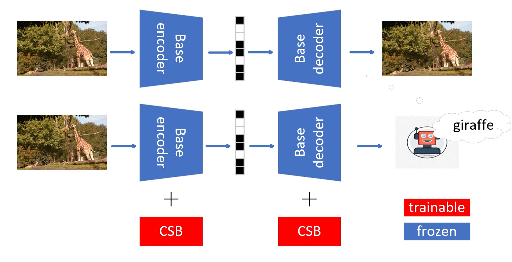

# Enhancing Joint Human–Machine Image Compression via a Chebyshev Space Modulation

## Overview

*The overall framework*



## Abstract

Recent advancements in computer vision necessitate efficient image compression methods that cater to both human and machine perception. Traditional learned image compression models optimized for human visual quality often fail to preserve semantic information crucial for machine vision tasks. This paper introduces a lightweight adapter‑based tuning framework incorporating the **ChebSpace Block (CSB)**, which leverages Chebyshev polynomial bases to modulate intermediate features adaptively. This approach enhances convolutional neural network responses to task‑relevant features while suppressing spatial noise. Experimental results demonstrate that our method outperforms state‑of‑the‑art ICMH approaches across multiple tasks, including classification, object detection, and instance segmentation, with significantly reduced trainable parameters and computational overhead.

## Environment

```bash
pip install compressai
pip install timm tqdm click
```
Install **Detectron2** for object detection and instance segmentation.

## Dataset

The following datasets are used and need to be downloaded.

- ImageNet1K  
- COCO 2017 Train/Val  
- Kodak

## Example Usage

### Classification
```bash
python examples/classification.py -c config/classification.yaml
```
*Add argument `-T` for evaluation.*

### Object Detection
```bash
python examples/detection.py -c config/detection.yaml
```
*Add argument `-T` for evaluation.*

### Instance Segmentation
```bash
python examples/segmentation.py -c config/segmentation.yaml
```
*Add argument `-T` for evaluation.*
